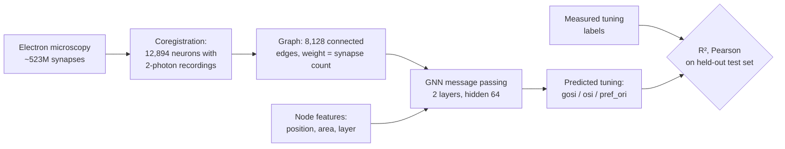
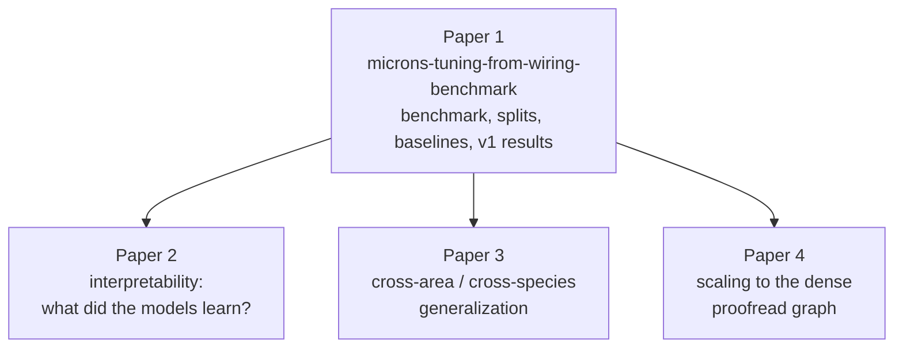

# Extended Introduction — A Beginner's Guide to Predicting Tuning from Wiring

**Audience:** this document assumes *zero* background in neuroscience or machine learning. If you have never heard the words "synapse" or "gradient descent" before, you are in the right place. Each section builds from scratch, uses everyday analogies, and links out to gentle external resources for anything mathematical.

**Series note:** This is **Paper 1 of 4** in the MICrONS function-from-wiring series [1]. Papers 2 (interpretability), 3 (cross-area/cross-species generalization), and 4 (scalability) all build on this paper's benchmark, splits, and trained models. See the series diagram below.

---

## 1. Neurons and synapses, in one minute

Your brain is made of about 86 billion cells called **neurons**. A neuron is a tiny information-processing device: it collects electrical signals from other neurons, adds them up, and — if the sum crosses a threshold — fires its own signal down the line. The connections between neurons are called **synapses**. A synapse is a one-way junction: neuron A (the "presynaptic" cell) releases chemicals that neuron B (the "postsynaptic" cell) detects. Some synapses excite the receiving neuron (push it toward firing), others inhibit it (push it away). A single cortical neuron can receive thousands of synapses.

Analogy: think of neurons as people in a huge office and synapses as one-directional memo tubes. Each person reads incoming memos, forms an opinion, and sends their own memos onward. What any one person "thinks" depends on *who sends them memos* and *how strong those tubes are*.

## 2. What is a connectome?

A **connectome** is the complete wiring diagram of a piece of brain: a list of every neuron and every synapse between them. The classic analogy is a **city's road map versus the traffic**. The connectome is the road map — which streets exist, which direction they run, how wide they are. The *activity* of neurons — which ones fire, when, and in response to what — is the traffic flowing over those roads. A central question of modern neuroscience is: how much of the traffic pattern can you explain if all you have is the road map?

The first complete connectome was the 302-neuron nervous system of the worm *Caenorhabditis elegans*, reconstructed by White and colleagues in a heroic thirteen-year effort using electron microscopy [2]. For decades it remained the only one, because mapping even a speck of mammalian brain is astonishingly hard.

## 3. Electron microscopy reconstruction, briefly

To see synapses you need nanometer resolution — far beyond what a light microscope can do. **Electron microscopy (EM)** works by slicing brain tissue into ultra-thin sections (tens of nanometers), imaging each section with an electron beam, and then using machine learning to stitch and trace every neuron's branches through the enormous stack of images. Reconstructing one cubic millimeter of brain this way produces *petabytes* of imagery and requires ML-based segmentation to follow individual axons and dendrites through densely packed tissue [1]. The output is a wiring diagram: neuron identities, their shapes, and every synapse between them.

## 4. The MICrONS project: a cubic millimeter of mouse visual cortex

**MICrONS** (Machine Intelligence from Cortical Networks) is a large collaboration funded by IARPA and executed by the Allen Institute, Baylor College of Medicine, and Princeton University [1]. The team reconstructed roughly **one cubic millimeter of mouse visual cortex** — about the size of a grain of sand — containing more than **200,000 cells** and about **523 million synaptic connections** [3,4].

What makes MICrONS unique is a second, crucial ingredient. *Before* the tissue was extracted for EM, researchers imaged the same volume in a living, awake mouse using **two-photon calcium imaging** while the mouse watched controlled visual stimuli (moving gratings and natural movies). Calcium imaging is a technique where neurons are engineered to fluoresce when they are active, letting researchers record the activity of tens of thousands of neurons simultaneously. Afterwards, about **75,000 neurons** recorded in the living mouse were matched — "coregistered" — to specific cells in the EM reconstruction [3]. MICrONS is thus the first large mammalian dataset where we know both the wiring *and* the activity of the same neurons.

## 5. What does "visual tuning" mean?

Neurons in visual cortex are picky. Each one responds most strongly to a particular kind of visual pattern — classically, an edge or bar at a specific **orientation** (vertical, horizontal, tilted 45°...). This preference is called the neuron's **tuning**, and its strength is measured by numbers such as the **orientation selectivity index (OSI)**. Analogy: each neuron has a *favorite pattern*, like a radio tuned to a favorite station — it turns up its volume (firing rate) when that pattern appears and stays quiet otherwise.

This repository predicts three tuning properties per neuron [5]:

- `gosi` — global orientation selectivity index (how selective, overall),
- `osi` — orientation selectivity index,
- `pref_ori` — the neuron's preferred orientation, encoded as `cos(2·θ)` because orientation repeats every 180°.

## 6. The big question

> **Can you predict what a neuron *does* — its favorite pattern — from only *who it is wired to*?**

If the road map determines the traffic, then given the connectome alone (no recordings, no images), a good model should predict each neuron's tuning. Early MICrONS analyses gave reason for hope: Ding et al. found a general **"like-to-like" wiring rule** — connected excitatory neurons tend to share similar visual responses [6]. And in the fruit fly, models constrained by the connectome can predict neural activity across the visual system [7,8]. But no public, reproducible benchmark had ever quantified how well tuning is predictable from wiring alone in mammalian cortex — with fixed train/test splits, strong baselines, and honest null controls. That is exactly what this repository provides [1].

## 7. Graphs and graph neural networks, in plain terms

A connectome is naturally a **graph**: neurons are **nodes** (dots), synapses are directed, weighted **edges** (arrows whose thickness is the synapse count). This repo's `ConnectomeGraph` is exactly that — node features (position, brain area, layer), an edge list, and edge weights [9].

A **graph neural network (GNN)** is a learning algorithm designed for such graphs. The core idea is **message passing**, which you can think of as *neurons gossiping with their neighbors*:

1. Every neuron starts with an "opinion" (a vector of numbers built from its features — where it sits, what area and layer it's in).
2. Each neuron sends a message to everyone it has a synapse onto, and collects messages from everyone wired into it.
3. Each neuron updates its opinion by combining its old opinion with the gossip it received.
4. Repeat for a few rounds, so information trickles outward along the wiring.
5. Finally, each neuron's refined opinion is used to predict its tuning.

Here is the actual update rule used in this repo's `MessagePassingLayer` [10]:

```
h_i ← ReLU( W_upd [ h_i ‖ Σ_j  w_ji · W_msg h_j ] )
```

In one plain sentence: *each neuron's new opinion is a learned combination of its old opinion and the weighted sum of its incoming neighbors' opinions, passed through a simple on/off (ReLU) nonlinearity.* (Here `‖` means "concatenate", `w_ji` is the synapse count from j to i, and the `W`s are learned weight matrices.) If you'd like the intuition behind learned weights and nonlinearities, watch 3Blue1Brown's neural-network series (https://www.3blue1brown.com/topics/neural-networks) and StatQuest's neural network videos (https://statquest.org/video-index/).

### The whole pipeline at a glance



### A tiny message-passing example

Five neurons, four synapses. After one round, neuron E's opinion contains gossip from C and D, which in turn contain gossip from A and B.

```mermaid
flowchart LR
    A((A)) -->|3 synapses| C((C))
    B((B)) -->|1 synapse| C
    C -->|5 synapses| E((E))
    D((D)) -->|2 synapses| E
    subgraph round1[One message-passing round]
      E2[E collects 5·msg(C) + 2·msg(D),<br/>mixes with its own opinion]:::note
    end
    classDef note fill:#fff8dc,stroke:#999;
```

### The four-paper series



## 8. How we measure success (one sentence each)

- **R² (coefficient of determination):** how much of the variation in true tuning the model explains, where 1.0 is perfect, 0 means "no better than just predicting the average", and — importantly — it *can be negative* if the model is worse than the average. Gentle intro: StatQuest's R² video (https://statquest.org/).
- **Pearson correlation:** how strongly predictions and true values move together, from −1 (perfectly opposite) to +1 (perfectly aligned), regardless of scale. Interactive intro: Seeing Theory (https://seeing-theory.brown.edu/).
- **Train/validation/test split:** we fit the model on 60% of neurons (train), use 20% to decide when to stop training (validation), and report scores only on a final, untouched 20% (test) — so the reported numbers estimate performance on neurons the model has never seen. Here the split is by nucleus ID and fixed forever in `data/splits.csv` [5].

## 9. The negative result — honestly, and why it matters

Here is what actually happened when we ran the benchmark on real data [5,11]:

- The dataset has **12,894 coregistered neurons** but only **8,128 connected edges** — about **1.3 edges per neuron**. The graph is extremely sparse because we only know connections *between pairs of neurons that both happened to be recorded and reconstructed*.
- The best model is the **features-only MLP** (position, area, layer — no wiring at all): R² ≈ 0.06, Pearson ≈ 0.25 on orientation selectivity.
- The **GNN does worse** (R² ≈ 0.04) and — the key control — its score is **unchanged (ΔR² ≈ 0.001) when the graph is replaced by a degree-preserving rewired null** that shuffles which neuron connects to which while keeping each neuron's number of connections identical.

In plain language: at this sparsity, *who* a neuron is wired to carries no measurable extra information about its tuning beyond *where* it sits. With only ~1.3 gossip partners per neuron, message passing has almost nothing to gossip about.

**Why this is valuable, not a failure.** Science advances by quantifying effects, including zero effects. This benchmark establishes, reproducibly and with pre-registered metrics [5], that (i) the sparse coregistered graph alone is insufficient, and (ii) any future claim of "wiring predicts tuning" must beat these baselines and these nulls. It also points exactly at the fix: use the **full proofread EM graph** via the CAVE interface (a free token; see `docs/DATA_ACCESS.md`), where each neuron has hundreds of known partners, and scale up in **Paper 4**. A negative result with a hard benchmark, fixed splits, and a clear path forward is a foundation the rest of the series stands on — not a dead end.

## 10. Try it yourself

```bash
pip install -e ".[dev]"
python -m wiring_tuning.harness            # reproduces the real-data leaderboard
python -m wiring_tuning.harness --check    # verifies the committed numbers
```

Everything downloads automatically (~500 MB once, no account needed) and the leaderboard is regenerated from scratch [9,11].

---

## References

1. This repository's planning doc: `docs/INTRODUCTION.md` (series position, background, gap, methods).
2. White, J. G. et al. The structure of the nervous system of the nematode *Caenorhabditis elegans*. *Phil. Trans. R. Soc. B* 314, 1–340 (1986). DOI: 10.1098/rstb.1986.0056
3. MICrONS Consortium et al. Functional connectomics spanning multiple areas of mouse visual cortex. *Nature* 640, 435–447 (2025). DOI: 10.1038/s41586-025-08790-w
4. Turner, N. L. et al. Reconstruction of neocortex. *Cell* 185, 1082–1100 (2022). DOI: 10.1016/j.cell.2022.01.023
5. `docs/ANALYSIS_PLAN.md` — pre-registered data, models, metrics, and results summary.
6. Ding, Z. et al. Functional connectomics reveals general wiring rule in mouse visual cortex. *Nature* 640, 459–469 (2025). DOI: 10.1038/s41586-025-08840-3
7. Lappalainen, J. K. et al. Connectome-constrained networks predict neural activity across the fly visual system. *Nature* 634, 1132–1140 (2024).
8. Dorkenwald, S. et al. Neuronal wiring diagram of an adult brain. *Nature* 634, 124–138 (2024).
9. `src/wiring_tuning/microns.py` — dataset assembly, checksums, splits; `src/wiring_tuning/graphs.py` — the `ConnectomeGraph`.
10. `src/wiring_tuning/models.py` — `MessagePassingLayer` and `GNNRegressor`.
11. `reports/leaderboard_summary.csv` — per-(property, graph, model) means and 95% CIs over seeds 0–2.
