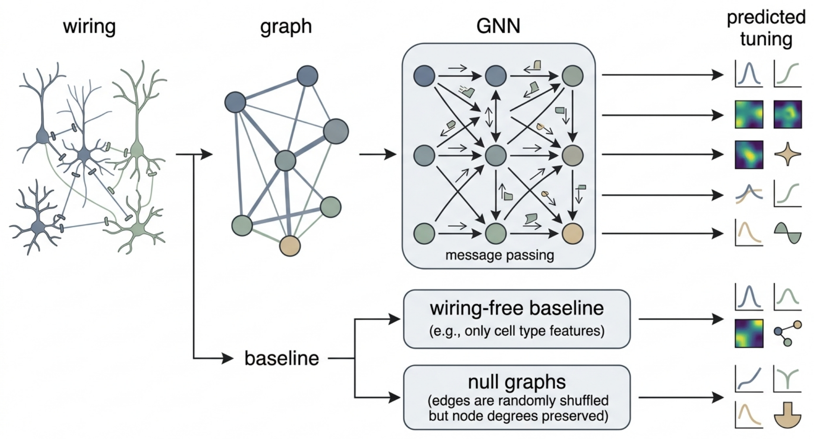
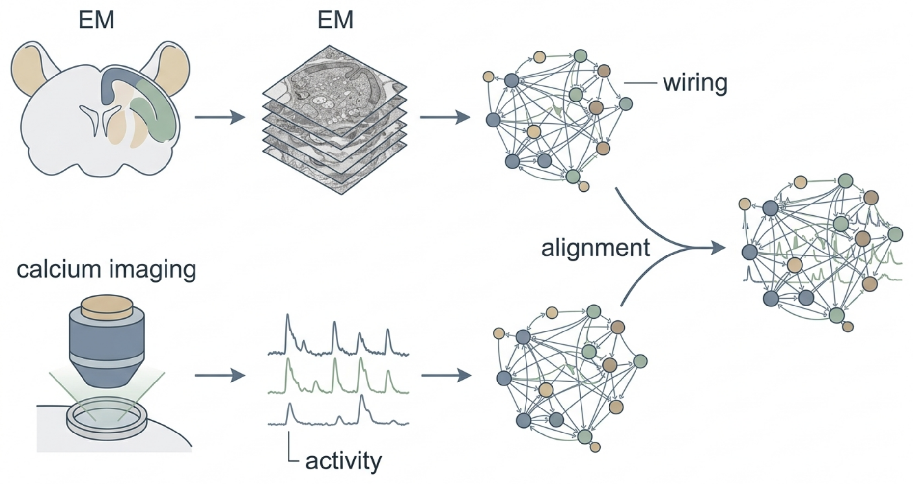
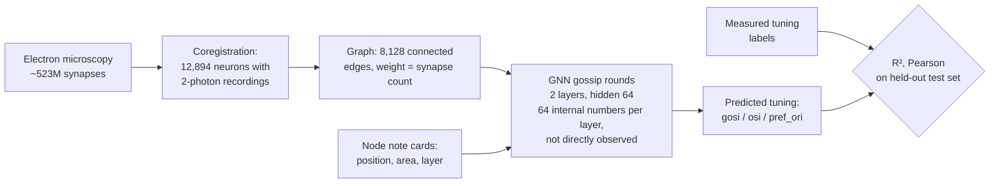

# Extended Introduction — A Beginner's Guide to Predicting Tuning from Wiring



*Figure 1. The pipeline: an EM-derived wiring diagram becomes a graph of nodes and arrows; a graph neural network passes messages along those arrows; the result is a predicted tuning curve per neuron, scored honestly against wiring-free baselines and shuffled-wiring nulls.*

**Audience:** this document assumes *zero* background in neuroscience or machine learning. Every technical idea is first shown on a tiny concrete example you could draw on paper, then explained in words, and only then written in symbols — which are just shorthand for the paper example.



*Data workflow: The same mouse visual cortex volume is imaged with electron microscopy to reconstruct wiring and with two-photon calcium imaging to record neuronal activity, then the two are aligned.*

## Start here: the math toolkit from zero

Every symbol used later in this document is defined here in plain words, with a tiny numeric example. Nothing below assumes any math background — if you can add and multiply, you can check every line. Come back whenever a symbol looks unfamiliar.

- **Vector.** A vector is just a short list of numbers, kept in a fixed order, written like $`(3, 1)`$. A neuron's "note card" here is a vector. *Example:* (3, 1) might mean "3 convergence motifs, 1 triplet".
- **Matrix.** A matrix is a table of numbers with rows and columns — a spreadsheet. $`M = \begin{pmatrix} 0 & 3 \\ 1 & 0 \end{pmatrix}`$ has 2 rows and 2 columns. Multiplying a matrix by a vector means "compute one weighted sum per row".
- **Sum (Σ).** The symbol $`\sum`$ means "add these up": $`\sum_{j} w_j`$ with weights $`w = (3, 1, 5)`$ is $`3 + 1 + 5 = 9`$. The little letter under the Σ just names what you are adding over.
- **Weighted sum.** Multiply each item by its importance, then add: $`3 \cdot 1 + 1 \cdot 1 = 4`$ is the weighted sum of two identical cards with weights 3 and 1. This is the single most common computation in this document.
- **Probability (as a fraction).** A probability is a count divided by a total, always between 0 and 1. *Example:* 9 hits out of 20 neurons is the probability estimate $`9/20 = 0.45`$.
- **Expectation (average).** The expectation, written $`\mathbb{E}[x]`$ or $`\bar{x}`$, is the ordinary average: add everything, divide by the count. *Example:* the average of (0.5, 0.1, 0.3, 0.9) is $`1.8/4 = 0.45`$.
- **Logarithm base 2 (log₂) and bits.** $`\log_2(n)`$ answers "how many yes/no questions to pin down one choice among $`n`$ equally likely options": $`\log_2(8) = 3`$, because $`2^3 = 8`$. **Entropy** is the average number of such questions a random quantity carries: $`H = -\sum_i p_i \log_2 p_i`$; a fair coin has $`H = 1`$ bit.
- **Graph.** A graph $`G = (V, E)`$ is a set of dots (nodes $`V`$) plus a set of arrows (edges $`E`$), optionally with numbers (weights) on the arrows. *Example:* $`V = \{A, B, C\}`$, $`E = \{A \to C,\, B \to C\}`$ with weights 3 and 1 is a tiny wiring diagram.
- **Dot product.** Multiply two vectors position by position and add the results: $`(3, 1) \cdot (2, 4) = 3 \cdot 2 + 1 \cdot 4 = 10`$. It measures how much two vectors "point the same way".
- **Cosine similarity.** The dot product divided by the vector lengths, $`\cos\theta = \frac{u \cdot v}{\lVert u \rVert \, \lVert v \rVert}`$, giving a number from −1 (opposite) to +1 (same direction). *Example:* for $`u = (1, 0)`$ and $`v = (1, 1)`$, $`\cos\theta = 1/\sqrt{2} \approx 0.71`$.
- **R² (coefficient of determination).** $`R^2 = 1 - \frac{\text{model's squared errors}}{\text{squared errors of always guessing the average}}`$. *Example:* model errors 0.03 vs. lazy errors 0.35 gives $`R^2 = 1 - 0.03/0.35 \approx 0.91`$; 0 means "no better than guessing the average".
- **Pearson correlation (r).** A number from −1 to +1 measuring whether two lists of numbers rise and fall together, ignoring their scale. *Example:* predictions (0.4, 0.2, 0.3, 0.8) and truths (0.5, 0.1, 0.3, 0.9) rise together, so $`r`$ is near +1.

---

## 1. Neurons and synapses, in one minute

Your brain is made of about 86 billion cells called **neurons**. A neuron is a tiny information-processing device: it collects electrical signals from other neurons, adds them up, and — if the sum crosses a threshold — fires its own signal onward. The connection points are called **synapses**. A synapse is one-way: neuron A (the "presynaptic" cell) releases chemicals that neuron B (the "postsynaptic" cell) detects. Some synapses excite the receiver (nudge it toward firing); others inhibit it. One cortical neuron can receive thousands of synapses.

Analogy: neurons are people in a huge office; synapses are one-directional memo tubes. What any person "thinks" depends on *who sends them memos* and *how strong those tubes are*.

## 2. What is a connectome?

A **connectome** is the complete wiring diagram of a piece of brain: every neuron and every synapse. The classic analogy is a **city's road map versus the traffic**. The connectome is the road map; the *activity* of neurons — who fires, when, in response to what — is the traffic. The central question of this work: **how much of the traffic can you explain with only the road map?**

The first complete connectome was the 302-neuron nervous system of the worm *Caenorhabditis elegans*, reconstructed by White and colleagues in a thirteen-year electron-microscopy effort [2]. For decades it was the only one, because mapping even a speck of mammalian brain is astonishingly hard.

## 3. Electron microscopy reconstruction, briefly

Synapses are far too small for light microscopes. **Electron microscopy (EM)** slices tissue into tens-of-nanometers sections, images each with an electron beam, and uses machine learning to trace every neuron's branches through the image stack. One cubic millimeter of brain yields *petabytes* of imagery [1]. The output is a wiring diagram: cell identities, shapes, and every synapse.

## 4. MICrONS: a cubic millimeter of mouse visual cortex

**MICrONS** (Machine Intelligence from Cortical Networks) is an IARPA-funded collaboration among the Allen Institute, Baylor College of Medicine, and Princeton [1]. It reconstructed roughly **one cubic millimeter of mouse visual cortex** — a grain of sand — containing **>200,000 cells** and **~523 million synapses** [3,4].

The crucial second ingredient: *before* the tissue was extracted, researchers imaged the same volume in a living, awake mouse using **two-photon calcium imaging** while the mouse watched moving gratings and natural movies. (Calcium imaging makes neurons flash when active, so thousands can be recorded at once.) About **75,000 recorded neurons** were later matched — "coregistered" — to cells in the EM reconstruction [3]. MICrONS is the first large mammalian dataset where we know both the wiring *and* the activity of the same neurons.

## 5. What does "visual tuning" mean?

Visual-cortex neurons are picky: each responds most strongly to a particular pattern — classically, a bar at a specific **orientation** (vertical, horizontal, 45°...). This preference is the neuron's **tuning**; its strength is summarized by numbers like the **orientation selectivity index (OSI)**. Analogy: each neuron has a *favorite pattern*, like a radio tuned to one station.

This repository predicts three tuning properties per neuron [5]: `gosi` (global orientation selectivity), `osi` (orientation selectivity), and `pref_ori` (preferred orientation, encoded as `cos(2·θ)` because orientation repeats every 180°).

### The many roads to visual tuning

Tuning — "this neuron prefers vertical bars" — has several independent formal faces.

**Road 1: geometry (a preference is a point).** Because orientation repeats every 180°, this repo encodes preferred orientation as cos(2·θ): an angle becomes a *coordinate*. Draw a circle; horizontal preference is the point (1, 0), 45° is (0, 1) in doubled-angle coordinates, vertical is (−1, 0). "Two neurons like similar stimuli" becomes "their points are close together". *Worked example:* θ = 0° gives cos(0) = 1, the point (1, 0); θ = 90° gives cos(180°) = −1, the point (−1, 0); the distance between these opposite preferences is 2 — the diameter of the circle, i.e. maximal disagreement, exactly as it should be. In symbols, the encoding is

```math
x = \cos(2\theta), \qquad \theta = 0^\circ \Rightarrow x = 1, \quad \theta = 90^\circ \Rightarrow x = -1,
```

— the same two numbers computed above. *What this road buys you:* similarity, averaging, and prediction error become distances you can see. *What it costs you:* one coordinate pair captures only orientation; richer tuning (color, motion direction, natural scenes) needs more dimensions, and the pictures stop being drawable.

**Road 2: probability as frequencies (tuning is a table of counts).** Forget curves: show the neuron 4 stimuli (0°, 45°, 90°, 135°), 10 trials each, and count strong responses. *Worked example:* neuron A responds strongly in 9, 3, 1, 3 of the 10 trials per stimulus. Its tuning *is* the row of counts (9, 3, 1, 3); its preferred orientation is the biggest column (0°), and "selectivity" is how lopsided the row is: best count 9 versus average of the rest (3+1+3)/3 ≈ 2.3, a ratio of about 4 to 1 — strongly selective. A row of (4, 4, 4, 4) is ratio 1 — no selectivity at all. *What this road buys you:* tuning becomes arithmetic on counts — no curve fitting, no assumptions, every step checkable. *What it costs you:* with few trials the counts are noisy (9 out of 10 can happen by luck), so this road must borrow error bars from statistics before it can claim anything.

## 6. The big question

> **Can you predict what a neuron *does* from only *who it is wired to*?**

Early MICrONS analyses gave hope: Ding et al. found a **"like-to-like" rule** — connected excitatory neurons tend to share similar visual responses [6]. In the fruit fly, wiring-constrained models predict neural activity across the visual system [7,8]. But no public, reproducible benchmark had quantified how well tuning is predictable from wiring alone in mammalian cortex — with fixed splits, strong baselines, and honest nulls. That is what this repository provides [1].

## 7. Graphs, built on four neurons drawn on paper

Take a paper napkin and draw four dots labeled A, B, C, D. Now draw an arrow from A to C, and write "3" next to it to mean "A makes 3 synapses onto C". Add B → C with "1", C → D with "5". That's it: **you have just drawn a graph**, and it is a perfectly good tiny connectome.

The jargon is just renaming what you drew:

- Each dot is a **node** (a neuron).
- Each arrow is an **edge** (a synaptic connection).
- The number on the arrow is the **edge weight** (synapse count).
- Because arrows point one way, the graph is **directed**.
- Neuron C's **in-degree** is 2 (two arrows in); A's is 0.

This repo's `ConnectomeGraph` is this napkin drawing at scale: an edge list, edge weights, and per-node features (position, brain area, layer) [9]. "Graph theory" for our purposes is mostly the skill of counting arrows on the napkin.

### The many roads to the connectome

One object — the wiring diagram — can be entered through several doors. Pick whichever matches your habits; they all describe the same napkin.

**Road 1: graph theory (nodes and edges).** The connectome is a directed, weighted graph: a set of nodes and a set of arrows with numbers on them. Everything in this repository is built from three graph operations you can do on the napkin: count arrows into a node (in-degree), follow a chain of arrows (a path), and list a node's arrow-neighbors (its neighborhood). *Worked example:* on our napkin, C has in-degree 2 (from A and B), there is exactly one path from A to D (A → C → D, total weight passing through edges 3 and 5), and D's incoming neighborhood is just {C}. *What this road buys you:* the native language of connectomics — null models, motifs, and message passing are all statements about arrows. *What it costs you:* the graph throws away geometry; two neurons can be graph-neighbors while sitting millimeters apart.

**Road 2: set theory (membership and constraints).** The same napkin is two sets and a table: a node set V = {A, B, C, D} and an edge set E = {(A,C), (B,C), (C,D)}, plus a weight table w with w(A,C) = 3, w(B,C) = 1, w(C,D) = 5. Asking "is A wired to D?" is the membership test (A,D) ∈ E, which fails. A subgraph is just a subset; the coregistered graph used here is the subset of MICrONS edges where *both* endpoints were also recorded — a constraint expressed purely as set intersection. *What this road buys you:* precision — every claim ("the null preserves degree") becomes a checkable statement about sets and counts. *What it costs you:* sets have no built-in notion of "influence flowing", so dynamics have to be added by hand.

**Road 3: category-flavored composition (arrows that compose).** Read each arrow as "has a direct line to". Arrows *compose*: A → C and C → D give a composite path A ⇢ D, and the napkin's whole meaning is which composites exist. A motif (say, a feedforward triplet A → B, B → C, A → C) is then a small diagram in which two roads — the direct arrow and the two-step composite — share start and destination; Later analyses lean hard on counting such diagrams. *Worked example:* our napkin has two composites of length 2 (A ⇢ D via C, and B ⇢ D via C) and none of length 3, so "news from A reaches D in exactly 2 hops" is a pure composition count. *What this road buys you:* paths and motifs become the primitive objects, which is exactly what interpretability needs. *What it costs you:* weights and probabilities fit awkwardly; it is a qualitative skeleton, not a quantitative model.

## 8. A graph neural network = gossip on the napkin

Now the learning model. We want to predict D's tuning without being told it. All we have is the wiring. The idea, called **message passing**, is gossip:

1. **Give everyone a starter opinion.** Each node gets a short list of numbers — call it a *note card* — filled in from what we know (where it sits, its layer). A's card might read `(position 2.1, layer 4, ...)`.
2. **Pass notes along arrows.** A writes its card, multiplied by the arrow weight 3, and hands it to C. B hands C its card times 1. C now holds `3·(A's card) + 1·(B's card)` plus its own card.
3. **Rewrite your card.** C mixes the received notes with its old card, using a small recipe of numbers called *weights* — the only things the model ever learns — and a simple "keep the positive parts" rule called **ReLU** (negative numbers become 0; positives pass through unchanged).
4. **Repeat** for a couple of rounds, so news travels further along the arrows. After round 2, D's card contains traces of A and B, carried via C.
5. **Read out the answer.** A final little recipe maps each neuron's last card to three numbers: predicted `gosi`, `osi`, `pref_ori`.

A **graph neural network (GNN)** is exactly this gossip procedure, with the mixing recipes learned from examples. Here is the actual update rule in this repo's `MessagePassingLayer` [10], with the napkin translation right below it:

```
h_i ← ReLU( W_upd [ h_i ‖ Σ_j  w_ji · W_msg h_j ] )
```

The same rule in rendered math (GitHub renders LaTeX), identical to the code line above:

```math
h_i \leftarrow \mathrm{ReLU}\!\left(W_{upd}\,\big[h_i \,\Vert\, \textstyle\sum_{j} w_{ji}\, W_{msg}\, h_j\big]\right)
```

*Tiny-number check:* with card value 1 for every neuron and napkin weights 3 and 1 into C, the sum inside the brackets is $`3 \cdot 1 + 1 \cdot 1 = 4`$ — exactly the arithmetic worked out in Road 1 below.

**Word-by-word:** `h_i` is neuron i's note card; `w_ji` is the arrow weight from j to i (the "3" on A → C); `Σ_j` means "add up over all neurons j that point into i" (the gossip collection); `W_msg` and `W_upd` are the learned mixing recipes; `‖` means "place two lists side by side"; ReLU is the keep-the-positives rule. In one sentence: *each neuron's new card is a learned mixture of its old card and the weighted sum of incoming neighbors' cards.* For the intuition behind learned weights and nonlinearities, see 3Blue1Brown's neural-network series (https://www.3blue1brown.com/topics/neural-networks) and StatQuest (https://statquest.org/video-index/).

### The many roads to message passing

The gossip update above is the official description, but the same computation has at least three independent faces.

**Road 1: linear algebra as a weight table.** Write the napkin as a table T where row = receiver, column = sender, and the cell holds the arrow weight:

```
        sender:  A   B   C   D
receiver A       0   0   0   0
         B       0   0   0   0
         C       3   1   0   0
         D       0   0   5   0
```

One gossip round is "each row takes a weighted sum of the senders' cards". *Worked example:* if every card is the single number 1 (A=B=C=D=1), then C's incoming sum is 3·1 + 1·1 = 4 and D's is 5·1 = 5 — read straight off the C and D rows. A second round is the same table applied to the new cards: D now receives 5·(C's new card). "Matrix multiplication" is nothing more than doing every row of this table at once. *What this road buys you:* the whole GNN becomes table arithmetic a spreadsheet can check, and two rounds = apply the table twice. *What it costs you:* the table for half a billion synapses is mostly zeros; the table view hides how sparse the real thing is, which is Paper 4's whole problem.

**Road 2: discrete iterated maps (tomorrow = f(today)).** Think of the cards as a state that advances in clock ticks: card(t+1) = mix(card(t), neighbors' cards(t)). No calculus anywhere — just a rule applied over and over. *Worked example:* give A, B, C, D starting cards 1, 0, 0, 0 and use the rule "each neuron with incoming arrows replaces its card by the weighted sum of incoming cards (weights from the napkin); neurons without incoming arrows keep their card". Then t=0: (1,0,0,0); t=1: (1,0,3,0) because C computes 3·1 + 1·0; t=2: (1,0,3,15) because C recomputes the same 3 and D computes 5·3. News of A reaches D at t=2 — you watched the signal travel. Stability questions ("does the state settle?") become: does iterating the table stop changing the cards? *What this road buys you:* training-free simulation — you can trace *exactly* which round carries whose influence, which is what attribution analysis formalizes. *What it costs you:* the learned recipes W_msg, W_upd enter as black-box tables here; this road explains the mechanics, not the learning.

**Road 3: information theory by counting.** Ask: how many yes/no questions does one gossip round answer about "where did D's card come from"? Before gossip, D's card could have been influenced by any of 4 nodes — log2(4) = 2 questions of uncertainty. After one round you know only C's arrow touches D, so the influence came from a set of size 1: 2 − log2(1) = 2 questions answered, i.e. the wiring told you 2 bits about the source of D's update. On the real sparse graph (1.3 edges per neuron) a neuron "collects news" from barely more than one partner, so the wiring answers close to zero questions per neuron — which is the information-theoretic way to state this benchmark's negative result. *What this road buys you:* a unit of measurement (bits/questions) for "how much the wiring could possibly tell you", comparable across graphs. *What it costs you:* counting questions assumes influences are distinct and independent; correlated neighbors make the real number smaller than the count suggests.

### How the recipes get learned (training, in one paragraph)

Start with random recipes. For each training neuron, the model makes a prediction; we compare it with that neuron's *measured* tuning and get an error number. A standard procedure called **gradient descent** nudges every recipe number slightly in the direction that would have reduced the error — imagine turning thousands of tiny knobs downhill on an error landscape. Repeat many times and the recipes become good at predicting tuning from cards. That's all "training a neural network" means here.

### The whole pipeline at a glance



### The napkin example as a diagram

```mermaid
flowchart LR
    A((A)) -->|3 synapses| C((C))
    B((B)) -->|1 synapse| C
    C -->|5 synapses| D((D))
    subgraph round1[One gossip round]
      N[C rewrites its card using<br/>3·card(A) + 1·card(B)]:::note
    end
    classDef note fill:#fff8dc,stroke:#999;
```


## 9. How we measure success — each metric on the napkin

Suppose the true `osi` values of our four neurons are A: 0.5, B: 0.1, C: 0.3, D: 0.9, and a model predicts 0.4, 0.2, 0.3, 0.8.

- **R² (coefficient of determination):** compare the model's errors against the errors of a lazy predictor that always guesses the average (0.45). If the model's squared errors are 40% smaller, R² = 0.4. R² = 1 is perfect, 0 means "no better than the average", and it *can be negative* if the model is worse than lazy. In symbols, for truths $`y_i`$, predictions $`\hat{y}_i`$, and mean $`\bar{y}`$:

```math
R^2 = 1 - \frac{\sum_i (y_i - \hat{y}_i)^2}{\sum_i (y_i - \bar{y})^2}
```

The napkin computation from Road 1 of this section: model squared errors $`0.01 + 0.01 + 0 + 0.01 = 0.03`$, lazy squared errors $`0.35`$, so $`R^2 = 1 - 0.03/0.35 \approx 0.91`$. Gentle intro: StatQuest's R² video (https://statquest.org/).
- **Pearson correlation:** do predictions and truths *move together*? Here the prediction rises whenever the truth rises, so the correlation is high (+1 is perfect lockstep, −1 perfectly opposite, regardless of scale). In symbols, for paired lists $`x`$ (truths) and $`y`$ (predictions):

```math
r = \frac{\sum_i (x_i - \bar{x})(y_i - \bar{y})}{\sqrt{\sum_i (x_i - \bar{x})^2}\,\sqrt{\sum_i (y_i - \bar{y})^2}}
```

Each term $`(x_i - \bar{x})(y_i - \bar{y})`$ is positive when truth and prediction are on the same side of their averages — which happens for all four napkin neurons here, hence the high $`r`$. Interactive intro: Seeing Theory (https://seeing-theory.brown.edu/).
- **Train/validation/test split:** hide some napkin neurons from the model. We fit recipes on 60% of neurons (train), use 20% to decide when to stop knob-turning (validation), and report scores only on a final untouched 20% (test) — estimating performance on neurons never seen. The split is by nucleus ID and fixed forever in `data/splits.csv` [5].
- **Null graphs (the honesty control):** redraw the napkin keeping each neuron's number of arrows but shuffling *who* points to *whom* (a "degree-preserving rewire"). If the model's score doesn't drop, it wasn't using the actual wiring — just arrow counts.

### The many roads to measuring success

"Did the model do well?" is one question with several honest ways to formalize it.

**Road 1: probability as frequencies (counting wins and losses).** Line up the napkin neurons and score each prediction as hit or miss against a tolerance. *Worked example:* truths 0.5, 0.1, 0.3, 0.9; predictions 0.4, 0.2, 0.3, 0.8. With tolerance 0.15, every prediction is within 0.1 of the truth: 4 hits out of 4. A lazy predictor that always guesses the mean 0.45 scores errors 0.05, 0.35, 0.15, 0.45 — only 2 hits out of 4. "The model beats the baseline" is now the count statement 4/4 > 2/4, and R² is the same idea with squared errors instead of hit counts: model squared errors 0.01+0.01+0+0.01 = 0.03 versus lazy 0.0025+0.1225+0.0225+0.2025 = 0.35, so R² = 1 − 0.03/0.35 ≈ 0.91 on this toy napkin. *What this road buys you:* every metric is a fraction of counts you can audit by hand. *What it costs you:* fractions on 4 neurons mean little; this road needs many test neurons before the counts stabilize.

**Road 2: information theory by counting (the null as a question budget).** The degree-preserving null asks: how much does *who* points to *whom* tell you, beyond *how many* arrows each neuron has? *Worked example:* on the napkin, C's in-degree is 2. If you only know "C has 2 inputs among {A, B, D}", there are 3 possible input sets ({A,B}, {A,D}, {B,D}) — log2(3) ≈ 1.6 questions of uncertainty. Learning the true wiring {A, B} answers those 1.6 questions. If the GNN's score does not drop when that 1.6-bit answer is scrambled, the model never used it — the null test in one sentence. *What this road buys you:* "the wiring carries no extra information" becomes a countable claim, not a vibe. *What it costs you:* real nulls preserve more than degree (cell types, spatial layout), and each extra constraint shrinks the question budget in ways that are hard to count exactly.

**Road 3: set theory (the split as disjoint subsets).** Train/validation/test is purely set bookkeeping: partition the neurons into three disjoint subsets — 60% for fitting recipes, 20% for deciding when to stop, 20% never touched until the final score. *Worked example:* with 10 neurons, that is {6 train} ∪ {2 validation} ∪ {2 test}, pairwise disjoint, union = all 10. "No leakage" means exactly: the intersection of train and test is the empty set. *What this road buys you:* the single most common way benchmarks lie (test data seeping into training) becomes a set identity anyone can check in `data/splits.csv`. *What it costs you:* disjointness of neurons does not guarantee disjointness of *information* — two test neurons wired to train neurons are not fully independent, which is why the null graphs of Road 2 still matter.

## 10. The negative result — honestly, and why it matters

What actually happened on real data [5,11]:

- The coregistered set has **12,894 neurons** but only **8,128 connected edges** — ~**1.3 edges per neuron**. The graph is sparse because we only know connections *between pairs both recorded and reconstructed*.
- The best model is the **features-only MLP** (position, area, layer; no wiring): R² ≈ 0.06, Pearson ≈ 0.25 on orientation selectivity.
- The **GNN does worse** (R² ≈ 0.04), and its score is **unchanged (ΔR² ≈ 0.001) on the degree-preserving rewired null**.

In plain language: at this sparsity, *who* a neuron is wired to carries no measurable extra information beyond *where* it sits. With ~1.3 gossip partners per neuron, there is almost nothing to gossip about.

**Why this is valuable, not a failure.** Science advances by quantifying effects, including zero effects. This benchmark establishes reproducibly, with pre-registered metrics [5] — the analysis plan was written down and locked before looking at the results, so the test cannot be quietly adjusted afterward — that (i) the sparse coregistered graph alone is insufficient, and (ii) any future claim of "wiring predicts tuning" must beat these baselines and these nulls. It also points at the fix: the **full proofread EM graph** via the CAVE interface (free token; see `docs/DATA_ACCESS.md`), where each neuron has hundreds of partners — scaled up in later work. A negative result with a hard benchmark and a clear path forward is the foundation the series stands on.

## 11. Try it yourself

```bash
pip install -e ".[dev]"
python -m wiring_tuning.harness            # reproduces the real-data leaderboard
python -m wiring_tuning.harness --check    # verifies the committed numbers
```

Everything downloads automatically (~500 MB once, no account needed) [9,11].

---

## Choosing your road

Every core idea in this document was presented through several independent doors, and you only need one per idea. If you think in drawings of dots and arrows, take the graph-theory road throughout. If you think in spreadsheets and tables, take the weight-table road for message passing and the frequency road for tuning and metrics. If you think in code, take the discrete iterated map road — a GNN layer is a loop you can write in ten lines. If you think in sets and constraints, the connectome-as-sets and split-as-partition roads will feel like home. If you think in questions and answers, take the information-by-counting roads — they state both the benchmark's honesty controls and its negative result in the cleanest units. And if you think in pictures, the geometry road turns tuning into points on a circle. The roads meet at the same destination: this benchmark's claim that, at ~1.3 edges per neuron, wiring alone does not yet predict tuning — with the tools to check that claim yourself, whichever road you took to get there.

## Learn more (verified links)

Each link was checked to load and match the topic.

**Graph theory and GNNs**
- [Graph theory (Wikipedia)](https://en.wikipedia.org/wiki/Graph_theory) — the full vocabulary of nodes, edges, weights, and degrees behind Section 7's napkin, including connectomics as an application.
- [Kipf & Welling, "Semi-Supervised Classification with Graph Convolutional Networks" (arXiv:1609.02907)](https://arxiv.org/abs/1609.02907) — the short paper that introduced the GCN layer; its propagation rule is the ancestor of this repo's `MessagePassingLayer`.

**Neural networks and message passing**
- [3Blue1Brown: Neural Networks](https://www.3blue1brown.com/topics/neural-networks) — visual episodes on what learned weights and ReLU actually do, matching Section 8's gossip picture.
- [StatQuest video index](https://statquest.org/video-index/) — short, friendly lessons including gradient descent, R-squared, and cosine similarity, all used in Sections 8–9.

**R² and correlation**
- [Coefficient of determination (Wikipedia)](https://en.wikipedia.org/wiki/Coefficient_of_determination) — the formal $`R^2 = 1 - SS_{res}/SS_{tot}`$ definition and the caveats (including negative values) behind Section 9.
- [Pearson correlation coefficient (Wikipedia)](https://en.wikipedia.org/wiki/Pearson_correlation_coefficient) — the formula and geometric reading of $`r`$ used alongside R² in the leaderboard.

**Probability and information**
- [Seeing Theory](https://seeing-theory.brown.edu/) — interactive chapters on probability, distributions, and regression that build the intuition behind our splits and metrics.
- [Entropy (information theory) (Wikipedia)](https://en.wikipedia.org/wiki/Entropy_(information_theory)) — Shannon's $`H = -\sum p \log_2 p`$, the formal version of the "yes/no question budget" roads.

**Negative results in science**
- [Null result (Wikipedia)](https://en.wikipedia.org/wiki/Null_result) — why finding no effect is publishable knowledge; the framing behind Section 10's honest negative benchmark.

## References

1. This repository's planning doc: `docs/INTRODUCTION.md` (background, gap, methods).
2. White, J. G. et al. The structure of the nervous system of the nematode *Caenorhabditis elegans*. *Phil. Trans. R. Soc. B* 314, 1–340 (1986). DOI: 10.1098/rstb.1986.0056
3. MICrONS Consortium et al. Functional connectomics spanning multiple areas of mouse visual cortex. *Nature* 640, 435–447 (2025). DOI: 10.1038/s41586-025-08790-w
4. Turner, N. L. et al. Reconstruction of neocortex. *Cell* 185, 1082–1100 (2022). DOI: 10.1016/j.cell.2022.01.023
5. `docs/ANALYSIS_PLAN.md` — pre-registered data, models, metrics, and results summary.
6. Ding, Z. et al. Functional connectomics reveals general wiring rule in mouse visual cortex. *Nature* 640, 459–469 (2025). DOI: 10.1038/s41586-025-08840-3
7. Lappalainen, J. K. et al. Connectome-constrained networks predict neural activity across the fly visual system. *Nature* 634, 1132–1140 (2024). DOI: 10.1038/s41586-024-07939-3
8. Dorkenwald, S. et al. Neuronal wiring diagram of an adult brain. *Nature* 634, 124–138 (2024). DOI: 10.1038/s41586-024-07558-y
9. `src/wiring_tuning/microns.py` — dataset assembly, checksums, splits; `src/wiring_tuning/graphs.py` — the `ConnectomeGraph`.
10. `src/wiring_tuning/models.py` — `MessagePassingLayer` and `GNNRegressor`.
11. `reports/leaderboard_summary.csv` — per-(property, graph, model) means and 95% CIs over seeds 0–2.
