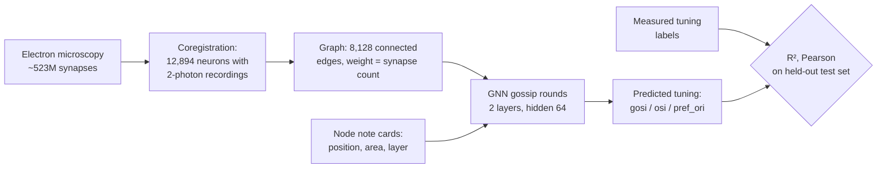
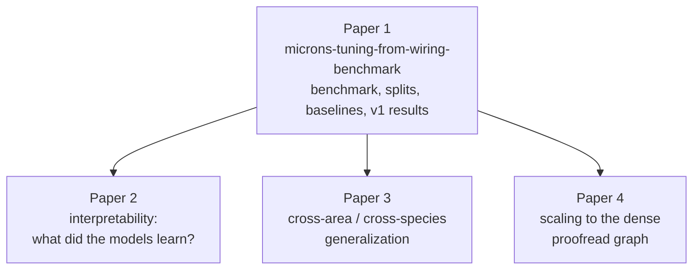

# Extended Introduction — A Beginner's Guide to Predicting Tuning from Wiring


*Figure 1. The Paper 1 pipeline: an EM-derived wiring diagram becomes a graph of nodes and arrows; a graph neural network passes messages along those arrows; the result is a predicted tuning curve per neuron, scored honestly against wiring-free baselines and shuffled-wiring nulls.*

**Audience:** this document assumes *zero* background in neuroscience or machine learning. Every technical idea is first shown on a tiny concrete example you could draw on paper, then explained in words, and only then written in symbols — which are just shorthand for the paper example.

**Series note:** This is **Paper 1 of 4** in the MICrONS function-from-wiring series [1]. Papers 2 (interpretability), 3 (cross-area/cross-species generalization), and 4 (scalability) all build on this paper's benchmark, splits, and trained models.

---

## 1. Neurons and synapses, in one minute

Your brain is made of about 86 billion cells called **neurons**. A neuron is a tiny information-processing device: it collects electrical signals from other neurons, adds them up, and — if the sum crosses a threshold — fires its own signal onward. The connection points are called **synapses**. A synapse is one-way: neuron A (the "presynaptic" cell) releases chemicals that neuron B (the "postsynaptic" cell) detects. Some synapses excite the receiver (nudge it toward firing); others inhibit it. One cortical neuron can receive thousands of synapses.

Analogy: neurons are people in a huge office; synapses are one-directional memo tubes. What any person "thinks" depends on *who sends them memos* and *how strong those tubes are*.

## 2. What is a connectome?

A **connectome** is the complete wiring diagram of a piece of brain: every neuron and every synapse. The classic analogy is a **city's road map versus the traffic**. The connectome is the road map; the *activity* of neurons — who fires, when, in response to what — is the traffic. The central question of this series: **how much of the traffic can you explain with only the road map?**

The first complete connectome was the 302-neuron nervous system of the worm *Caenorhabditis elegans*, reconstructed by White and colleagues in a thirteen-year electron-microscopy effort [2]. For decades it was the only one, because mapping even a speck of mammalian brain is astonishingly hard.

## 3. Electron microscopy reconstruction, briefly

Synapses are far too small for light microscopes. **Electron microscopy (EM)** slices tissue into tens-of-nanometers sections, images each with an electron beam, and uses machine learning to trace every neuron's branches through the image stack. One cubic millimeter of brain yields *petabytes* of imagery [1]. The output is a wiring diagram: cell identities, shapes, and every synapse.

## 4. MICrONS: a cubic millimeter of mouse visual cortex

**MICrONS** (Machine Intelligence from Cortical Networks) is an IARPA-funded collaboration among the Allen Institute, Baylor College of Medicine, and Princeton [1]. It reconstructed roughly **one cubic millimeter of mouse visual cortex** — a grain of sand — containing **>200,000 cells** and **~523 million synapses** [3,4].

The crucial second ingredient: *before* the tissue was extracted, researchers imaged the same volume in a living, awake mouse using **two-photon calcium imaging** while the mouse watched moving gratings and natural movies. (Calcium imaging makes neurons flash when active, so thousands can be recorded at once.) About **75,000 recorded neurons** were later matched — "coregistered" — to cells in the EM reconstruction [3]. MICrONS is the first large mammalian dataset where we know both the wiring *and* the activity of the same neurons.

## 5. What does "visual tuning" mean?

Visual-cortex neurons are picky: each responds most strongly to a particular pattern — classically, a bar at a specific **orientation** (vertical, horizontal, 45°...). This preference is the neuron's **tuning**; its strength is summarized by numbers like the **orientation selectivity index (OSI)**. Analogy: each neuron has a *favorite pattern*, like a radio tuned to one station.

This repository predicts three tuning properties per neuron [5]: `gosi` (global orientation selectivity), `osi` (orientation selectivity), and `pref_ori` (preferred orientation, encoded as `cos(2·θ)` because orientation repeats every 180°).

## 6. The big question

> **Can you predict what a neuron *does* from only *who it is wired to*?**

Early MICrONS analyses gave hope: Ding et al. found a **"like-to-like" rule** — connected excitatory neurons tend to share similar visual responses [6]. In the fruit fly, wiring-constrained models predict neural activity across the visual system [7,8]. But no public, reproducible benchmark had quantified how well tuning is predictable from wiring alone in mammalian cortex — with fixed splits, strong baselines, and honest nulls. That is what this repository provides [1].

## 7. Graphs, built on four neurons drawn on paper

Take a paper napkin and draw four dots labeled A, B, C, D. Now draw an arrow from A to C, and write "3" next to it to mean "A makes 3 synapses onto C". Add B → C with "1", C → D with "5". That's it: **you have just drawn a graph**, and it is a perfectly good tiny connectome.

The jargon is just renaming what you drew:

- Each dot is a **node** (a neuron).
- Each arrow is an **edge** (a synaptic connection).
- The number on the arrow is the **edge weight** (synapse count).
- Because arrows point one way, the graph is **directed**.
- Neuron C's **in-degree** is 2 (two arrows in); A's is 0.

This repo's `ConnectomeGraph` is this napkin drawing at scale: an edge list, edge weights, and per-node features (position, brain area, layer) [9]. "Graph theory" for our purposes is mostly the skill of counting arrows on the napkin.

## 8. A graph neural network = gossip on the napkin

Now the learning model. We want to predict D's tuning without being told it. All we have is the wiring. The idea, called **message passing**, is gossip:

1. **Give everyone a starter opinion.** Each node gets a short list of numbers — call it a *note card* — filled in from what we know (where it sits, its layer). A's card might read `(position 2.1, layer 4, ...)`.
2. **Pass notes along arrows.** A writes its card, multiplied by the arrow weight 3, and hands it to C. B hands C its card times 1. C now holds `3·(A's card) + 1·(B's card)` plus its own card.
3. **Rewrite your card.** C mixes the received notes with its old card, using a small recipe of numbers called *weights* — the only things the model ever learns — and a simple "keep the positive parts" rule called **ReLU** (negative numbers become 0; positives pass through unchanged).
4. **Repeat** for a couple of rounds, so news travels further along the arrows. After round 2, D's card contains traces of A and B, carried via C.
5. **Read out the answer.** A final little recipe maps each neuron's last card to three numbers: predicted `gosi`, `osi`, `pref_ori`.

A **graph neural network (GNN)** is exactly this gossip procedure, with the mixing recipes learned from examples. Here is the actual update rule in this repo's `MessagePassingLayer` [10], with the napkin translation right below it:

```
h_i ← ReLU( W_upd [ h_i ‖ Σ_j  w_ji · W_msg h_j ] )
```

**Word-by-word:** `h_i` is neuron i's note card; `w_ji` is the arrow weight from j to i (the "3" on A → C); `Σ_j` means "add up over all neurons j that point into i" (the gossip collection); `W_msg` and `W_upd` are the learned mixing recipes; `‖` means "place two lists side by side"; ReLU is the keep-the-positives rule. In one sentence: *each neuron's new card is a learned mixture of its old card and the weighted sum of incoming neighbors' cards.* For the intuition behind learned weights and nonlinearities, see 3Blue1Brown's neural-network series (https://www.3blue1brown.com/topics/neural-networks) and StatQuest (https://statquest.org/video-index/).

### How the recipes get learned (training, in one paragraph)

Start with random recipes. For each training neuron, the model makes a prediction; we compare it with that neuron's *measured* tuning and get an error number. A standard procedure called **gradient descent** nudges every recipe number slightly in the direction that would have reduced the error — imagine turning thousands of tiny knobs downhill on an error landscape. Repeat many times and the recipes become good at predicting tuning from cards. That's all "training a neural network" means here.

### The whole pipeline at a glance



### The napkin example as a diagram

```mermaid
flowchart LR
    A((A)) -->|3 synapses| C((C))
    B((B)) -->|1 synapse| C
    C -->|5 synapses| D((D))
    subgraph round1[One gossip round]
      N[C rewrites its card using<br/>3·card(A) + 1·card(B)]:::note
    end
    classDef note fill:#fff8dc,stroke:#999;
```

### The four-paper series



## 9. How we measure success — each metric on the napkin

Suppose the true `osi` values of our four neurons are A: 0.5, B: 0.1, C: 0.3, D: 0.9, and a model predicts 0.4, 0.2, 0.3, 0.8.

- **R² (coefficient of determination):** compare the model's errors against the errors of a lazy predictor that always guesses the average (0.45). If the model's squared errors are 40% smaller, R² = 0.4. R² = 1 is perfect, 0 means "no better than the average", and it *can be negative* if the model is worse than lazy. Gentle intro: StatQuest's R² video (https://statquest.org/).
- **Pearson correlation:** do predictions and truths *move together*? Here the prediction rises whenever the truth rises, so the correlation is high (+1 is perfect lockstep, −1 perfectly opposite, regardless of scale). Interactive intro: Seeing Theory (https://seeing-theory.brown.edu/).
- **Train/validation/test split:** hide some napkin neurons from the model. We fit recipes on 60% of neurons (train), use 20% to decide when to stop knob-turning (validation), and report scores only on a final untouched 20% (test) — estimating performance on neurons never seen. The split is by nucleus ID and fixed forever in `data/splits.csv` [5].
- **Null graphs (the honesty control):** redraw the napkin keeping each neuron's number of arrows but shuffling *who* points to *whom* (a "degree-preserving rewire"). If the model's score doesn't drop, it wasn't using the actual wiring — just arrow counts.

## 10. The negative result — honestly, and why it matters

What actually happened on real data [5,11]:

- The coregistered set has **12,894 neurons** but only **8,128 connected edges** — ~**1.3 edges per neuron**. The graph is sparse because we only know connections *between pairs both recorded and reconstructed*.
- The best model is the **features-only MLP** (position, area, layer; no wiring): R² ≈ 0.06, Pearson ≈ 0.25 on orientation selectivity.
- The **GNN does worse** (R² ≈ 0.04), and its score is **unchanged (ΔR² ≈ 0.001) on the degree-preserving rewired null**.

In plain language: at this sparsity, *who* a neuron is wired to carries no measurable extra information beyond *where* it sits. With ~1.3 gossip partners per neuron, there is almost nothing to gossip about.

**Why this is valuable, not a failure.** Science advances by quantifying effects, including zero effects. This benchmark establishes reproducibly, with pre-registered metrics [5], that (i) the sparse coregistered graph alone is insufficient, and (ii) any future claim of "wiring predicts tuning" must beat these baselines and these nulls. It also points at the fix: the **full proofread EM graph** via the CAVE interface (free token; see `docs/DATA_ACCESS.md`), where each neuron has hundreds of partners — scaled up in **Paper 4**. A negative result with a hard benchmark and a clear path forward is the foundation the series stands on.

## 11. Try it yourself

```bash
pip install -e ".[dev]"
python -m wiring_tuning.harness            # reproduces the real-data leaderboard
python -m wiring_tuning.harness --check    # verifies the committed numbers
```

Everything downloads automatically (~500 MB once, no account needed) [9,11].

---

## References

1. This repository's planning doc: `docs/INTRODUCTION.md` (series position, background, gap, methods).
2. White, J. G. et al. The structure of the nervous system of the nematode *Caenorhabditis elegans*. *Phil. Trans. R. Soc. B* 314, 1–340 (1986). DOI: 10.1098/rstb.1986.0056
3. MICrONS Consortium et al. Functional connectomics spanning multiple areas of mouse visual cortex. *Nature* 640, 435–447 (2025). DOI: 10.1038/s41586-025-08790-w
4. Turner, N. L. et al. Reconstruction of neocortex. *Cell* 185, 1082–1100 (2022). DOI: 10.1016/j.cell.2022.01.023
5. `docs/ANALYSIS_PLAN.md` — pre-registered data, models, metrics, and results summary.
6. Ding, Z. et al. Functional connectomics reveals general wiring rule in mouse visual cortex. *Nature* 640, 459–469 (2025). DOI: 10.1038/s41586-025-08840-3
7. Lappalainen, J. K. et al. Connectome-constrained networks predict neural activity across the fly visual system. *Nature* 634, 1132–1140 (2024).
8. Dorkenwald, S. et al. Neuronal wiring diagram of an adult brain. *Nature* 634, 124–138 (2024).
9. `src/wiring_tuning/microns.py` — dataset assembly, checksums, splits; `src/wiring_tuning/graphs.py` — the `ConnectomeGraph`.
10. `src/wiring_tuning/models.py` — `MessagePassingLayer` and `GNNRegressor`.
11. `reports/leaderboard_summary.csv` — per-(property, graph, model) means and 95% CIs over seeds 0–2.
