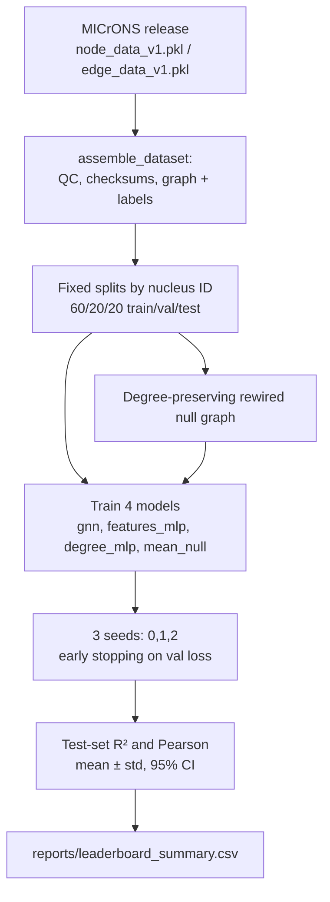

# Methods — Design Decisions and Statistics for New Contributors

**Audience:** new contributors who are new to data science and machine learning. This document explains what the benchmark does, *why* each design decision was made, and the statistical concepts you need to read (and extend) the results. It complements the pre-registered `docs/ANALYSIS_PLAN.md`, which states what was planned *before* the runs.

---

## Done

The following are implemented, tested, and reproducible today:

| Component | What it is | Where |
|---|---|---|
| Public-mirror loader | Anonymous S3 download (parallel range requests) of the MICrONS functional-connectomics release, with SHA-256 checksum verification in the manifest | `src/wiring_tuning/microns.py` |
| Dataset assembly | 12,894 coregistered neurons (V1/RL/AL/LM; L2/3–L5), 8,128 directed edges (`n_synapses >= 1`, weight = synapse count), fixed 60/20/20 node splits by nucleus ID | `microns.py::assemble_dataset`, `data/` |
| Models | Pure-PyTorch message-passing GNN (2 layers, hidden 64) plus three baselines: `features_mlp`, `degree_mlp`, `mean_null` | `src/wiring_tuning/models.py` |
| Null control | Degree-preserving double-edge rewiring of the real graph (10 swaps/edge) | `simulate.py::degree_preserving_rewire` |
| Benchmark | 3 seeds (0, 1, 2), test-set R² and Pearson per (property, graph, model, seed), 95% CIs across seeds | `harness.py`, `train.py` |
| One-command harness | `python -m wiring_tuning.harness` regenerates `reports/leaderboard_summary.csv`; `--check` verifies the committed leaderboard reproduces; `--synthetic` runs data-free | `src/wiring_tuning/harness.py` |
| Real results | features_mlp R² ≈ 0.06 > GNN R² ≈ 0.04; GNN unchanged on the rewired null (ΔR² ≈ 0.001); honest negative result at ~1.3 edges/neuron | `reports/leaderboard_summary.csv` |

## Intended

Planned but **not** yet implemented:

- **CAVE-token access to the full proofread graph.** The current dataset only contains edges between pairs of coregistered neurons (~1.3 edges/neuron). The full EM tables (`synapses_pni_2`, etc. on the `minnie65_public` datastack) hold hundreds of partners per neuron but require a free CAVE token (`CAVE_TOKEN` env var; see `try_cave_client` in `microns.py` and `docs/DATA_ACCESS.md`).
- **Manuscript outline + figures** (tracked in issue #1).
- Denser-graph reruns and scaling work are deferred to future work.

---

## Why the pipeline looks the way it does



### Why a degree-preserving rewired null is THE critical control

Suppose the GNN beats a simple baseline on the real graph. Does that prove *wiring* matters? Not yet. The GNN also sees each neuron's **degree** (how many synapses it sends and receives), and degree alone might carry all the signal — e.g., highly connected neurons might tend to sit in certain layers. A **degree-preserving rewiring** shuffles the edges randomly while keeping every neuron's in-degree and out-degree exactly fixed. It destroys *which* neuron connects to *which* while retaining all per-node connectivity statistics.

The logic is a clean subtraction:

- GNN(real) − GNN(rewired) = the value of **specific wiring beyond degree**.
- GNN(real) − features_mlp = the value of the graph beyond position/area/layer features.

In the v1 results both differences are ≈ 0 (ΔR² ≈ 0.001 real vs. rewired; GNN below features_mlp), which is exactly why we conclude wiring adds no *measurable* signal at this edge sparsity — rather than merely failing to find one. Without the null, we could not distinguish "wiring is uninformative" from "our model is bad".

### Why a features_mlp baseline

`features_mlp` sees only node features — standardized nucleus position (x, y, z) and one-hot brain area and layer — and no wiring at all. It answers: *how much tuning is predictable from where the neuron sits, without any connectivity?* Any graph model that cannot beat this baseline has not extracted useful wiring information. It is also a strong baseline in its own right: cortical position and layer are genuinely related to tuning, which is why it currently tops the leaderboard (R² ≈ 0.06).

`degree_mlp` (6 hand-crafted degree/E-I-balance features) sits between: it uses connectivity *statistics* but not the identity of partners. `mean_null` (always predicts the train-set mean) anchors the scale: its R² ≈ 0 by construction.

### Why 3 seeds and confidence intervals

Neural network training is stochastic: random weight initialization and (implicitly) data ordering make each run slightly different. A single run's score can be lucky or unlucky. Running seeds 0, 1, 2 and reporting **mean ± std and a 95% confidence interval (CI)** across seeds separates stable effects from run-to-run noise. Three seeds is a deliberately small, cheap budget fixed in advance in the analysis plan — enough to expose instability, not enough for fine-grained significance tests (see the statistics section below for upgrade options).

### Why masked node splits (no leakage)

**Leakage** means information from the test set sneaks into training, inflating reported scores. Here, splits are **node-level masks**: each neuron is in exactly one of train/val/test, fixed by nucleus ID in `data/splits.csv`. The loss is computed only on train-mask nodes (`train.py::train_model`), early stopping uses only val-mask nodes, and metrics are reported only on test-mask nodes. One subtlety worth knowing: the GNN's message passing aggregates over *all* edges, including edges touching test nodes' features — this is standard transductive node regression (the graph structure itself is legitimately available at prediction time), but **labels** of val/test nodes are never used during training.

### Why early stopping

**Overfitting** is when a model memorizes the training data instead of learning general patterns — training loss keeps dropping while performance on unseen data gets worse. We combat it by monitoring validation loss every epoch and stopping when it has not improved for 30 epochs (`patience = 30`), then restoring the best-seen weights. This uses the val split as a stand-in for "unseen data", keeping the test split pure for final reporting.

---

## Statistics for newcomers

### R² can be negative — really

R² = 1 − (sum of squared errors of the model) / (sum of squared errors of just predicting the mean). If your model is *worse* than simply predicting the average, the numerator exceeds the denominator and R² < 0. So R² = 0 is not "the model learned nothing"; it is "the model ties the mean baseline". Our `degree_mlp` scores (e.g., −0.01 on gosi) mean that model is slightly worse than predicting the mean on held-out neurons — a real, interpretable result, not a bug.

### Reading confidence intervals

The 95% CI across 3 seeds is a range that, under the usual assumptions, would contain the true mean score in 95% of hypothetical repeats of the whole experiment. Practical reading: if two models' CIs overlap substantially, treat their scores as indistinguishable at this budget; the pre-registered success criterion requires the GNN to beat both baselines and its rewired null *by more than the CI*.

### Paired comparison across seeds

Because all models are trained on the *same* seeds and the *same* splits, their scores are **paired**: seed 0's GNN score and seed 0's MLP score share all the seed-specific randomness. Comparing them **per-seed and then summarizing the differences** removes that shared noise and is much more sensitive than comparing two independent averages. Always compare model A vs. model B as the list of differences `[A_seed0 − B_seed0, A_seed1 − B_seed1, ...]`.

### Parametric vs. non-parametric: a decision guide

A **parametric test** assumes the data follow a specific distribution (usually: differences are approximately normally distributed). A **non-parametric test** makes weaker assumptions (usually: differences are comparable in rank, or nothing beyond exchangeability) at the cost of some statistical power when the stronger assumptions actually hold.

For comparing model scores across seeds/datasets, the three standard options:

| Test | Type | Assumes | Use when |
|---|---|---|---|
| **Paired t-test** | Parametric | Seed differences are ~normally distributed | Many seeds/datasets (roughly ≥ 20–30, or visibly bell-shaped differences) |
| **Wilcoxon signed-rank** | Non-parametric | Differences are symmetric around their median | Small samples, non-normal differences, want a standard test |
| **Permutation test on differences** | Non-parametric | Only that swapping labels under the null is fair (exchangeability) | Very small samples, want an exact, assumption-light answer; with 3 seeds the smallest achievable p-value is 0.25 — too coarse alone |

**Choice rule for this project:** with the current 3 seeds, *no* significance test is meaningful (n = 3 pairs is below Wilcoxon's useful range; a permutation test cannot reach conventional significance). That is why the current analysis reports **descriptive CIs** and a CI-overlap success criterion instead of p-values. When the benchmark is extended — more seeds (e.g., 10+) or scores across multiple datasets — upgrade to: permutation test or Wilcoxon for small/odd distributions, paired t-test only once normality of differences is plausible.

```mermaid
flowchart TB
    Q1{How many paired<br/>observations?} -->|n < ~8| A[Report descriptive CIs;<br/>no formal test<br/>(current approach)]
    Q1 -->|n ≥ ~8| Q2{Differences roughly<br/>normal & no outliers?}
    Q2 -->|yes| B[Paired t-test]
    Q2 -->|no / unsure| C[Wilcoxon signed-rank<br/>or permutation test]
    C --> D[Permutation preferred for<br/>very small n; Wilcoxon<br/>for moderate n]
```

### Four ML concepts you will meet in this codebase

- **Overfitting:** the model memorizes training noise; countered here by early stopping on validation loss and a fixed, small hyperparameter budget (no tuning on the test set).
- **Leakage:** test information contaminating training; countered by fixed node-level masks by nucleus ID and never touching test labels during training.
- **Null models / baselines:** deliberately simple references (`mean_null`, rewired graph, features-only) that a "real" model must beat to claim it learned something; a result is only as strong as the baselines it beats.
- **Negative results:** a well-controlled "no effect found" is a finding. Ours — wiring adds no measurable signal at ~1.3 edges/neuron — sets the bar for all future claims and motivates the denser CAVE graph.

---

## References within the repo

- Pre-registered plan and results summary: `docs/ANALYSIS_PLAN.md`
- Data access (S3 mirror, CAVE token): `docs/DATA_ACCESS.md`, `src/wiring_tuning/microns.py`
- Graph container and degree features: `src/wiring_tuning/graphs.py`
- Models: `src/wiring_tuning/models.py`; training/early stopping/masks: `src/wiring_tuning/train.py`
- Rewired null: `src/wiring_tuning/simulate.py`; harness: `src/wiring_tuning/harness.py`
- Numbers: `reports/leaderboard_summary.csv` (means, stds, 95% CIs over seeds 0–2)
