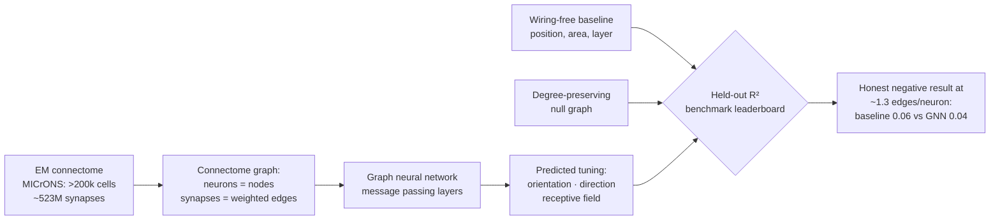

# Concept figure (Mermaid fallback) — Paper 1: Predicting Tuning from Wiring

> **Note.** The rendered concept figure is [`01-concept-schematic.png`](01-concept-schematic.png) in this folder — a generated scientific illustration. This file keeps the Mermaid source of the same diagram so it remains editable and re-renderable.

