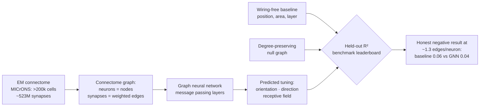

# Concept figure (Mermaid fallback) — Paper 1: Predicting Tuning from Wiring

> The canonical vector figure is `concept_figure.svg` in this directory. This file is a
> faithful Mermaid rendition kept as a text-based fallback (the PNG raster could not be
> committed through the available API tooling).

